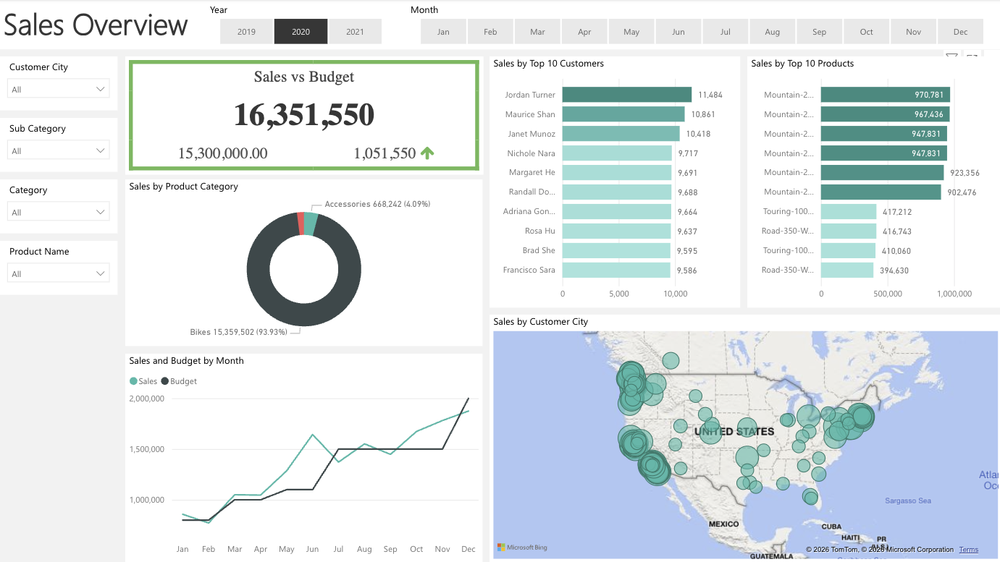
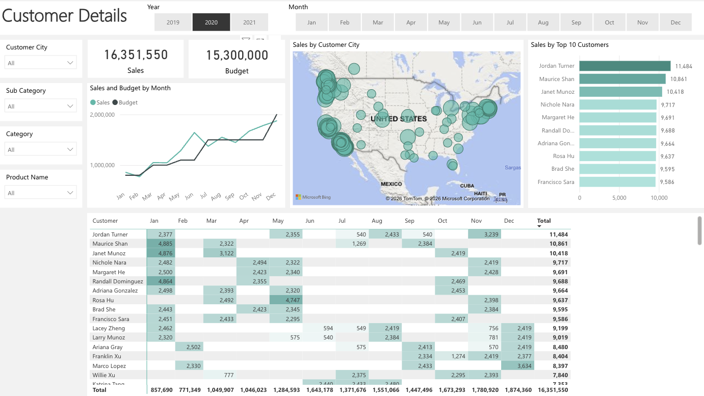
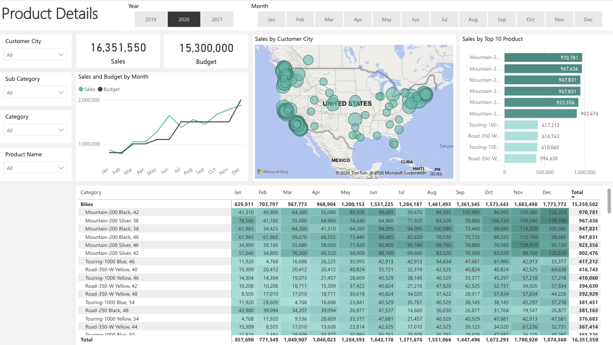

# Sales Performance Dashboard (SQL + Power BI)

This is an end-to-end data analytics portfolio project that simulates a real-world business
request from a sales manager. The project covers everything from data extraction and
transformation in SQL Server to an interactive Power BI dashboard tracking sales performance
against budget across customers, products, and geographies.

## Report Preview

| | | |
|---|---|---|
|  |  |  |

## Project Overview

| Field | Details |
|-------|---------|
| **Client** | Sales Manager |
| **Request** | Replace static Excel reports with an interactive dashboard showing internet sales performance vs. budget |
| **Tools** | SQL Server Express + SSMS, Power BI Desktop, Excel |
| **Dataset** | AdventureWorksDW 2019/2022 |
| **Time Period** | 2019 – 2021 (with 2020 as primary focus year) |

## Tools & Technologies

- **SQL Server Express + SSMS** — data extraction and transformation
- **Power BI Desktop** — data modelling, DAX measures, and dashboard development
- **AdventureWorksDW 2019/2022** — source data warehouse
- **Excel** — budget data integration

## Project Workflow

### 1. Business Request & Planning

- Parsed a stakeholder email into a formal **Business Demand Overview**
- Defined **User Stories** for both sales managers (overview performance) and sales representatives (customer and product-level detail)

### 2. Data Cleaning in SQL

Created cleaned dimension and fact tables using SQL best practices — joins, filtering, CASE statements, column renaming, and date formatting:

| Table | Description |
|-------|-------------|
| `Dim_Calendar` | Date dimension for Year/Month slicing (2019–2021) |
| `Dim_Customers` | Customer names, cities, and segments |
| `Dim_Products` | Product names, sub-categories, and categories (Bikes, Accessories, etc.) |
| `Fact_InternetSales` | Core transactional sales data, one row per order line |

### 3. Power BI Data Model

- Imported all cleaned CSV exports from SQL alongside the Excel budget file
- Built a **star schema** — `Fact_InternetSales` at the centre, connected to all four dimension tables via many-to-one relationships
- Created a dedicated **"Key Measures"** table with reusable DAX measures:

| Measure | Purpose |
|---------|---------|
| `Sales` | Total internet sales revenue |
| `Budget` | Target budget amount from Excel |
| `Sales vs Budget` | Absolute variance (Sales − Budget) |
| `Sales vs Budget %` | Percentage over/under budget |

### 4. Interactive Dashboard

The dashboard has three report pages, all filterable by **Year**, **Month**, **Customer City**, **Sub Category**, **Category**, and **Product Name**.

#### Sales Overview

The main landing page showing overall business performance at a glance.

- **KPI card** — Total Sales of **$16,351,550** vs. Budget of **$15,300,000**, with a positive variance of **+$1,051,550** highlighted in green
- **Donut chart** — Sales split by product category: Bikes dominate at **93.93%** ($15.3M), with Accessories at 4.09%
- **Line chart** — Monthly Sales vs. Budget trend showing sales tracking above budget from mid-year onward
- **Bar chart** — Top 10 Customers by revenue (Jordan Turner leading at $11,484)
- **Bar chart** — Top 10 Products by revenue (Mountain-200 variants dominating)
- **Bubble map** — Sales by Customer City across the United States

#### Customer Details

A deep-dive page for sales representatives to track individual customer performance.

- **KPI cards** — Headline Sales ($16.3M) and Budget ($15.3M) for consistent context
- **Bar chart** — Top 10 Customers ranked by total sales, with Jordan Turner, Maurice Shan, and Janet Munoz at the top
- **Matrix table** — Month-by-month breakdown per customer with row totals, making it easy to spot seasonal buying patterns
- **Line chart and bubble map** — Sales and Budget trend by month alongside geographic distribution of customers

#### Product Details

A deep-dive page for analysing product-level performance.

- **Bar chart** — Top 10 Products by revenue, with Mountain-200 Black and Silver variants filling the top 6 positions
- **Matrix table** — Monthly sales breakdown by product category and individual SKU, with colour-coded highlighting of top performers
- **Line chart** — Monthly Sales vs. Budget trend by product category
- **Bubble map** — Geographic sales distribution by customer city

### 5. Publishing

- Exported final `.pbix` file for portfolio sharing
- Published to **Power BI Service** for web embedding

## File Structure

| Folder | Content |
|--------|---------|
| `data/` | Cleaned CSV files + Excel budget |
| `sql/` | All SQL transformation queries |
| `powerbi/` | `.pbix` dashboard file |

## Key Skills Demonstrated

- Translating a business request into structured user stories and a data model
- Writing production-style SQL for data cleaning and dimension/fact table creation
- Building a star schema in Power BI with correct relationship cardinality
- Authoring DAX measures for KPIs, variance analysis, and budget comparison
- Designing a multi-page, fully interactive dashboard with consistent slicers across pages
- Communicating sales insights clearly through appropriate chart types (KPI cards, bar, line, donut, map, matrix)
